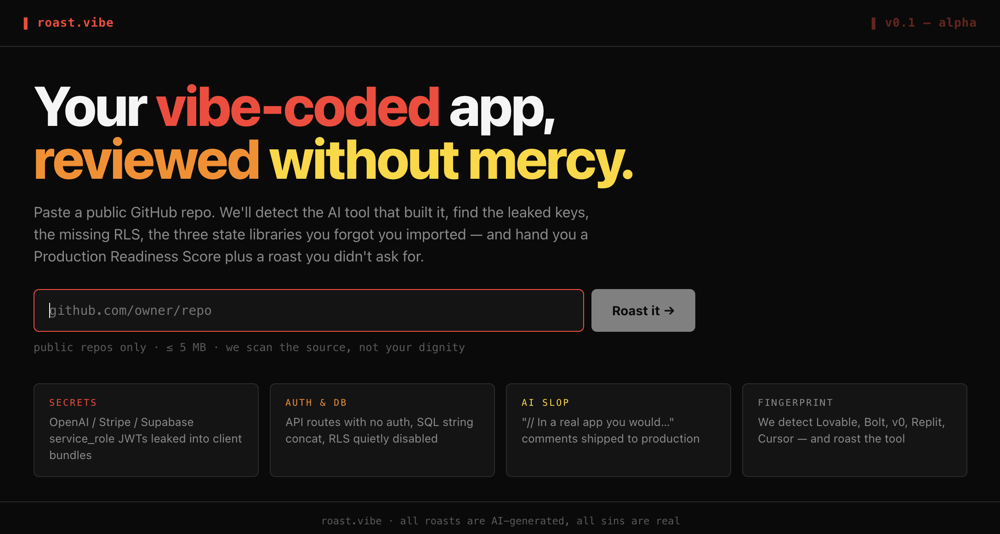
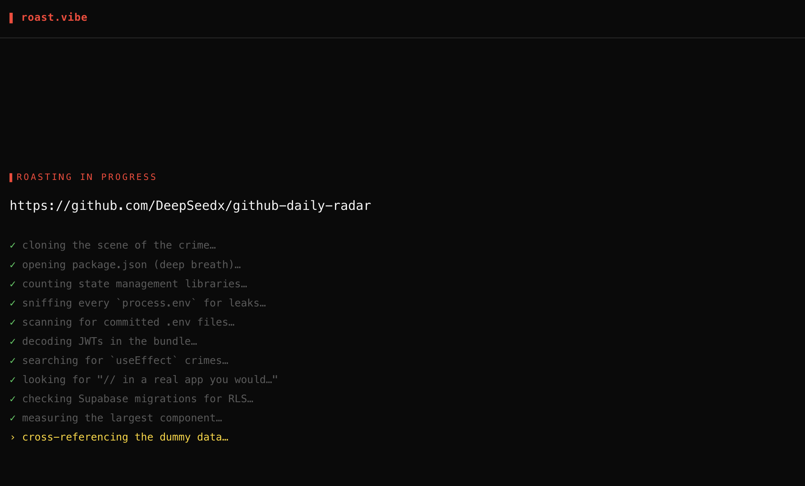
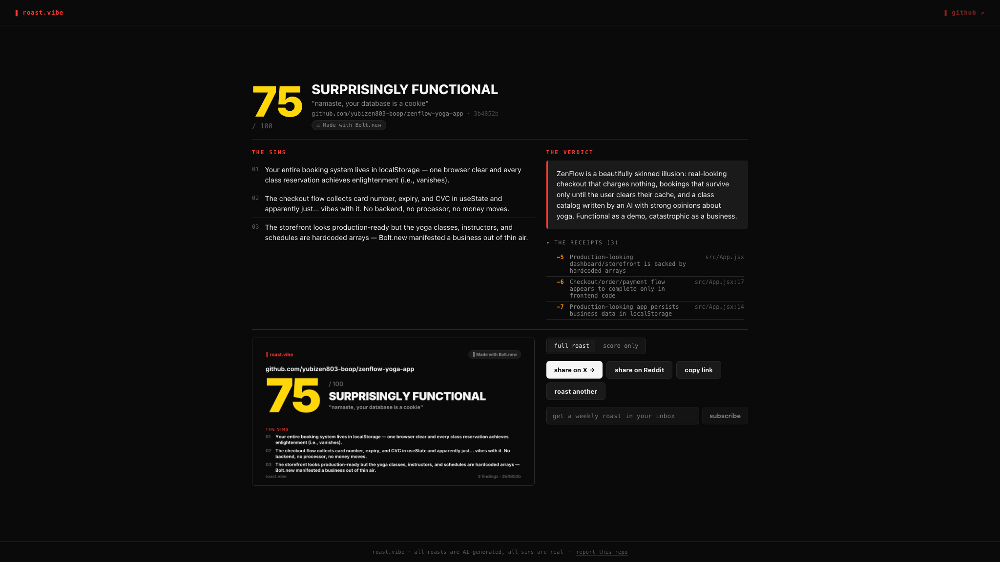
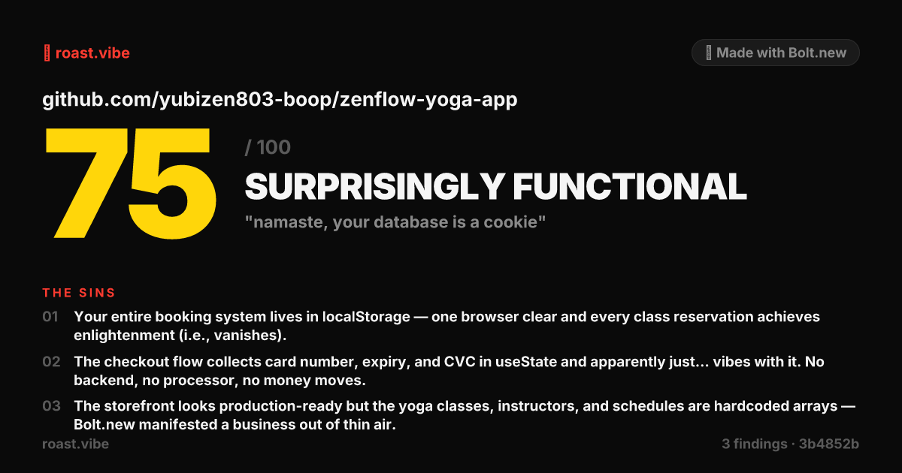
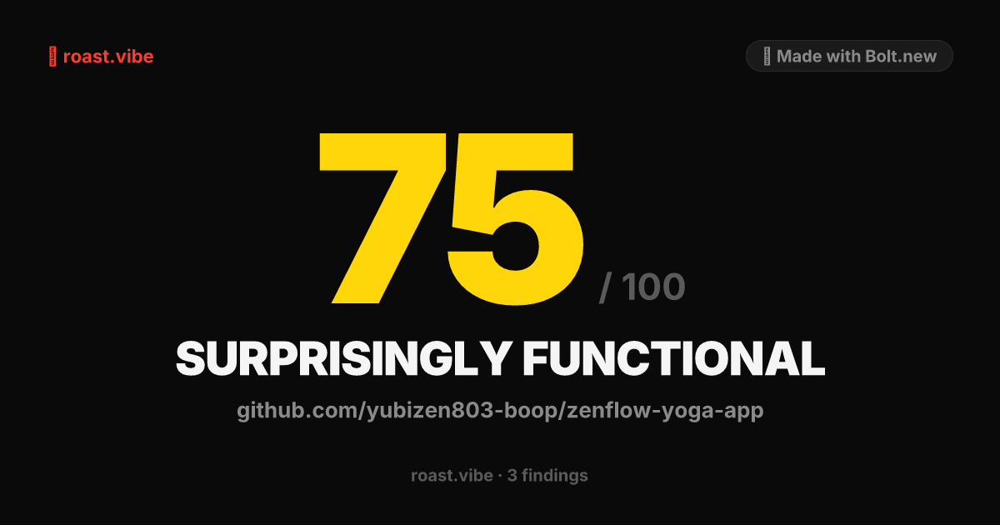

<div align="center">

# 🔥 Roast Vibe

### Your vibe-coded app, reviewed without mercy.


Submit a public GitHub repo. Get a deterministic **Production Readiness Score** (0–100), a savage LLM-written roast, and a shareable PNG card built for Twitter/X and Reddit.

</div>

---

## 💀 What this does

AI codegen tools (Lovable, Bolt.new, v0, Replit Agent, Cursor on autopilot) ship apps that *look* finished — but leak credentials, ignore Row Level Security, store JWTs in `localStorage`, and accumulate three state-management libraries that do the work of zero.

**Roast Vibe makes that funny *and* actionable.** Every line of every roast references a concrete scanner finding the submitter can fix.

> 🟢 *"checks the internet, leaks the secrets"* — sindresorhus/is-online (95/100)
>
> 🟡 *"v0 shipped John Doe to production"* — an e-commerce dashboard (93/100)
>
> 🔴 *"four .env files, zero shame"* — a Supabase-backed SaaS (39/100)

---

## 📸 Screenshots

<table>
  <tr>
    <td align="center"><b>Landing</b></td>
    <td align="center"><b>Loading</b></td>
    <td align="center"><b>Result</b></td>
  </tr>
  <tr>
    <td></td>
    <td></td>
    <td></td>
  </tr>
</table>

<table>
  <tr>
    <td align="center"><b>Share card — full</b></td>
    <td align="center"><b>Share card — score only</b></td>
  </tr>
  <tr>
    <td></td>
    <td></td>
  </tr>
</table>

---

## ⭐ Features

<table>
<tr>
<td width="50%" valign="top">

### 🔍 Deterministic scoring
25 rules across 5 buckets. Same repo + same commit → same score, forever. The LLM never touches the number.

### 🤖 Tool fingerprinting
Detects **Lovable**, **Bolt.new**, **v0**, **Replit Agent**, **Cursor**, and **Claude Code** apps and flavors the roast accordingly.

### 🎨 Edge-rendered share cards
Two PNG variants (full roast + score-only) generated by Satori + Resvg inside the Worker. Cached forever.

</td>
<td width="50%" valign="top">

### 🔗 Auto-unfurling links
`/r/:id` injects per-scan OG meta tags via HTMLRewriter — Twitter and Reddit auto-render the card when shared.

### 🛡️ Abuse controls built-in
Per-IP daily quota + global circuit breaker + repo-size cap + LLM prompt-size cap. All in D1, no Redis needed.

### 💸 Zero infra cost
Runs entirely on Cloudflare's free tier. The only paid line is OpenRouter (~$0.01–0.02 per scan on Sonnet-class models).

</td>
</tr>
</table>

---

## 🏗️ How it works

The architecture is a **funnel** — cheap deterministic work first, expensive LLM work last, on a minimal slice of code.

```
GitHub repo URL
      │
      ▼
[ 1. Fetch + filter ]      GitHub API. Skip node_modules/dist/lockfiles.
      │                    Cap at ~50 files, monorepo-aware (loads every
      │                    package.json in the tree).
      ▼
[ 2. Scan ]                ~25 deterministic rules across 5 buckets.
      │                    Each finding has severity + points.
      ▼
[ 3. Score ]               Sum capped deductions. Pure function.
      │                    Same input → same score, every time.
      ▼
[ 4. Roast ]               LLM call (OpenRouter) gets findings + ~5–10
      │                    code snippets. Returns: tagline, sins,
      │                    verdict. ~8K input tokens, capped.
      ▼
[ 5. Render cards ]        Satori + Resvg in the Worker.
      │                    Two PNG variants stored in DO storage.
      ▼
Result page + cached forever by repo + commit SHA.
```

---

## 🎯 Scanner buckets

| Bucket | Cap | Sample rules |
|---|---|---|
| 🚨 **Secrets** | -50 | Committed `.env`, OpenAI / Anthropic / Stripe / AWS / GitHub keys, Supabase `service_role` JWTs in client bundles |
| 🔐 **Auth & DB** | -30 | API routes with no auth check, SQL string concat, Supabase without RLS migrations, CORS wildcards, `localStorage` token storage |
| 🤡 **AI slop** | -20 | `// In a real app you would...` comments, `mockUsers` shipped to prod, default `<title>Vite + React</title>`, `alert()` as production UI |
| 🏷️ **Tool classifier** | 0 *(flavor)* | Lovable / Bolt.new / v0 / Replit Agent / Cursor / Claude Code fingerprinting |
| ⚠️ **Quality smells** | -10 | Multiple state libraries, async with no try/catch, mega-components |

Final score: `max(0, 100 - sum_of_capped_deductions)`. Bucket caps ensure no single category dominates.

---

## 🧪 Stack

| Layer | Tech |
|---|---|
| 🌐 Hosting | Cloudflare Workers (free plan) |
| 💾 Scan state + image cache | Durable Objects (SQLite-backed) |
| 🗄️ Relational data | D1 (SQLite) |
| ⚡ API framework | Hono |
| ⚛️ Frontend | React + Vite (served as Worker static assets) |
| 🎨 Share cards | [Satori](https://github.com/vercel/satori) + [`@resvg/resvg-wasm`](https://github.com/yisibl/resvg-js) |
| 🧠 LLM | OpenRouter (default: Claude Sonnet) |

---

## 📁 Project layout

```
roastvibe/
├── src/
│   ├── index.ts                  Hono router, API + /r/:id with OG meta injection
│   ├── do/ScanRunner.ts          Durable Object: orchestrates the scan
│   ├── github.ts                 Repo metadata, tree, file fetchers (monorepo-aware)
│   ├── scanners/                 Deterministic rules (one file per bucket)
│   ├── score.ts                  Findings → score, with bucket caps
│   ├── roast.ts                  OpenRouter call + prompt + snippet picker
│   ├── card/render.ts            Satori share-card rendering
│   ├── ratelimit.ts              D1-backed per-IP + global quotas
│   └── errors.ts                 Funny error catalog
├── frontend/                     React + Vite SPA (landing / loading / result)
├── migrations/                   D1 schema migrations
├── wrangler.jsonc                Workers config: DOs, D1, assets, env vars
├── SPEC.md                       Full design doc + decisions log
└── AGENTS.md                     Context pack for AI assistants editing this repo
```

---

## 🚀 Quick start

```bash
# One-time setup
npm install
cd frontend && npm install && cd ..

# Provision Cloudflare resources (see SETUP.md for full walkthrough)
npx wrangler login
npx wrangler d1 create roastvibe
npx wrangler secret put OPENROUTER_API_KEY
npx wrangler secret put GITHUB_PAT
cp .dev.vars.example .dev.vars       # paste the same two keys for local dev
npm run db:migrate:local
npm run db:migrate:remote

# Dev (two terminals)
npm run dev               # Worker + DOs on http://localhost:8787
npm run dev:frontend      # Vite with HMR on http://localhost:5180

# Reset local state (wipes DOs + re-applies migrations)
npm run reset:local

# Deploy
npm run deploy
```

---

## 🛡️ Abuse controls

- 📦 **Repo size cap:** 5 MB enforced before any file fetch
- 👤 **Per-IP daily quota:** 10 scans/day *(configurable)*
- 🌍 **Global daily quota:** 500 scans/day circuit breaker
- 💾 **Result caching:** keyed by `owner/repo`, identical resubmissions are free
- 📏 **Prompt-size cap:** LLM input hard-truncated at ~8K tokens
- 🚫 **Report link:** any user flag hides the public URL *(data stays for review)*

---

## 📅 Status

✅ **Phase 0** — Project scaffolding, devcontainer, secrets provisioning
✅ **Phase 1** — Scan pipeline backend (25 rules + scoring + LLM roast)
✅ **Phase 2** — Frontend, share cards, OG meta injection, newsletter capture
✅ **Phase 3** — Rate limiter, error catalog, report link, polish pass
🔄 **Phase 4** — Calibration with 15+ real-world repos + production launch

---

## 📚 Further reading

- 📋 **[SPEC.md](./SPEC.md)** — full design doc, architecture, decisions log
- 🤖 **[AGENTS.md](./AGENTS.md)** — orientation pack for AI assistants editing this codebase
- 🔧 **[SETUP.md](./SETUP.md)** — step-by-step provisioning walkthrough

---

<div align="center">

**The roast is harsh. The findings are real. Your dignity is not warrantied.**

Built solo. Powered by Cloudflare Workers + Claude.

</div>
